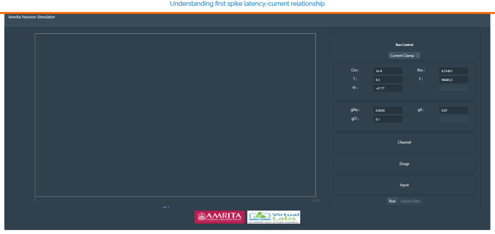
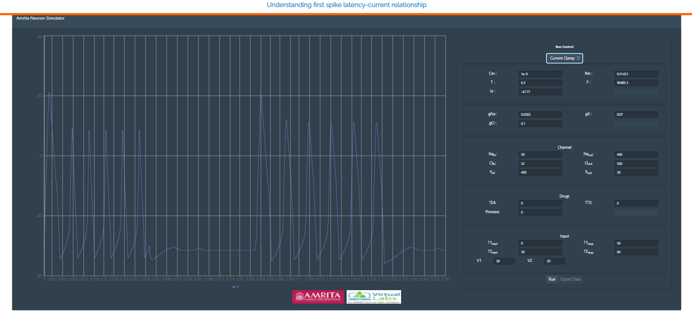
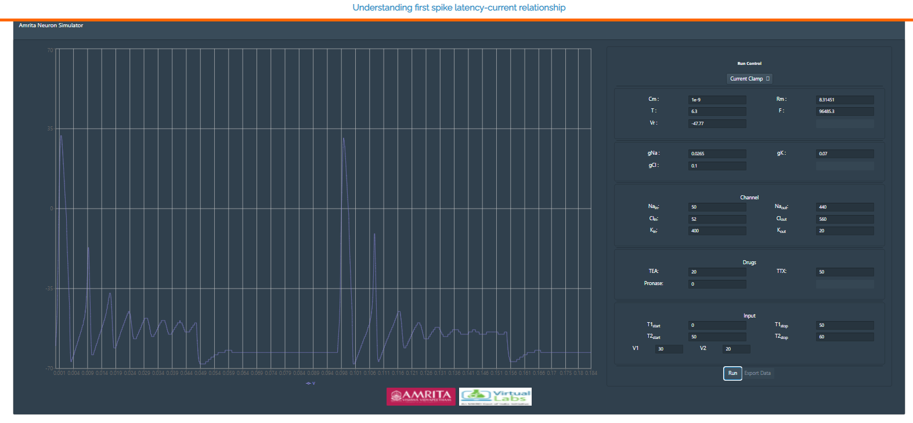
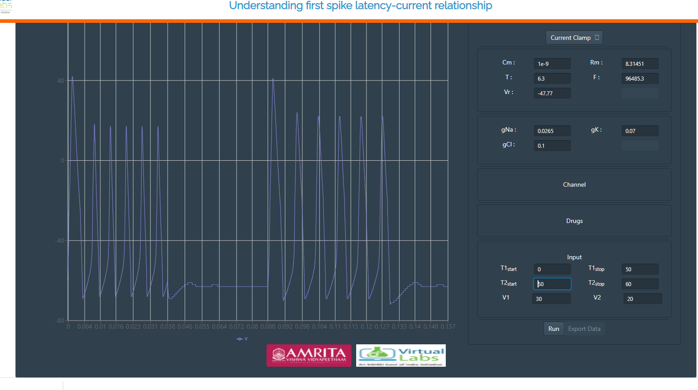

### Procedure

The web-based platform allows the user to generate different patterns of neuronal spikes by providing an input current or stimuli. The simulator was designed to understand the modulation of first spike latency to different input stimulus using HH model. Experiment explains how the intensity of input current modulates the first spike latency and to understand the importance of current clamp technique in understanding the behavior of electrically excitable cells like neurons.

•	The modeled stimulator has radio buttons to change different parameters for generating first spike latency with varying input currents.

 &nbsp;

•	The GUI allows the user to provide their choice of transmembrane voltage ie current clamp or voltage clamp by clicking on the “Run control” radio buttons. 

 &nbsp;

•	User can change the parameters like Cm=Membrane Capacitance (nF), Rm  = Membrane resistance (MΩ),Vr  = Resting Voltage (mV),T = Temperature (0C) and F= Frequency. 

 &nbsp;

•	The conductance of ion channels that generate an action potential can also change in the simulator ie gNa = Conductance of Sodium ions, gK= Conductance of Potassium ions, gCl= Conductance of Chloride ions.

 &nbsp;

•	User can provide internal or external ionic concentration (Sodium, chloride and potassium) in voltage gated ion channel simulator by clicking on “channel” window and understand the membrane properties of ion channels which generate an action potential.

 &nbsp;

•	To understand the ionic mechanisms of the action potentials in the channel, user can provide three selective chemical agents{(Tetrodotoxin(TTX) Tetraethyammonium(TEA),Pronase} which block the voltage dependent membrane channels. By clicking on “Drug” window, user can apply the agents TTX(Inhibit Na current), TEA (Inhibit K current) and Pronase (eliminate Na+ inactivation) at any point of the simulation.

 &nbsp;

•	The GUI also allows the user to provide varying time ranges as input parameters. T1 = Time (T1 start, suppose 10 s and T2 stop 20s). The simulator will read the output from 10s to 20s. Likewise T2 Start and T2 Stop can be given according to users choice. V1 and V2 indicates applied voltage at the specified time duration. 

 &nbsp;

•	After providing all parameter values in the GUI, user can click on “RUN” radio button to generate the action potential and by providing different input stimulus user can understand the first spike latency modulation via modeled neuron simulator.
•	If a user provides a transmembrane voltage as current clamp and their choice of parameters in the respective radio buttons, the generated action potential was observed as:

 &nbsp;

•	User can change the parameters and can see how the varying parameters change the spiking properties of neurons. In the default parameters, drug concentration is not given. User can give different concentration of drugs, all the three drugs at the same time, or one by one and can study how the drugs affect ion channels. 

•	If an user provide the drug values: TEA as 20% and TTX as 50%,the action potential was observed as :

 &nbsp;

•	This plot indicates the effect of applied drugs in the ion channels. Here the addition of TTX inhibited Na+ current and TEA inhibited K+ current. 

Input parameters provide user friendly flexible interface to fix amplitude, delay and duration of input current. This will simulate HH neuron model for given stimuli as current.  First spike latency can be estimated from output graph.

From the plot, note the values on the x-axis and y-axis and plot Current-vs-First spike latency graph (first spike latency on y-axis and injected current on x-axis)

