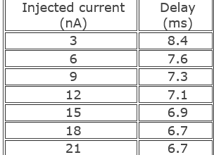
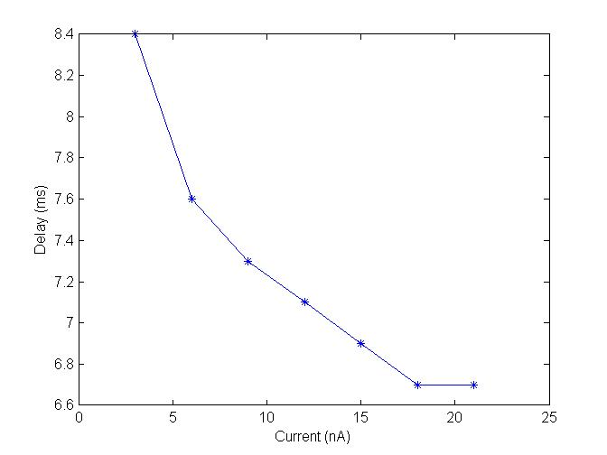

Electrically excitable cells (also called neurons) generate a series of voltage pulses in responses to different input as currents. These responses or electrical signals are also called action potentials or spikes which are usually originate near the soma and propagate through the axon with constant velocity and amplitude.

 

Neurophysiologists uses current clamp technique to study how a nerve cell responds to an applied electric current (stimuli) and these characteristics of a neuron (electrically excitable cell) depends on the membrane properties and channel kinetics.In order to understand the behavior of the cell one has to study the relationship between the stimuli and the response by applying a series of input stimuli with varying amplitude of current (ranges of nano amperes) (see Fig. 1). Here in this study we simulate a current clamp protocol by injecting 1 nA - 20 nA current to a Hodgkin Huxley neuron model (see Table 1, Fig 2) which is modeled along with the simulator.

 

 
 
&nbsp;

 

 

Fig 1. Schematic representation of current clamp experimental setup (left). Cartoon representation of membrane voltage recording at soma, a ‘bunch’ of spikes (also called burst) in response to current as input into the dendrites (right).

 
**First spike latency**

First spike latency is a time delay a nerve cell took to responds to a particular stimuli. In a series of input stimuli when the intensity of injected current increases cell will responsed as increased frequency of spikes with decreased first spike latency.

Series of studies in past few decades shows the importance of first spike latency in propagation / transmission of information in several information sensory system for example the auditory (Furukawa et al, 2001), visual (Reich et al, 2001), and somatosensory (Panzeri et al, 2001) systems.  And also the first spike latency code is very important for the independent identification of variety of sensory features.It has been prove that the stimulus parameters such as the location of sound or the color and contrast of the images can modulate the first spike timing in sensory neurons.
 

 

 
&nbsp;

 

Table 1. Listed are the injected input current and corresponding latency measured from Hodgkin Huxley neuron model (messured from exported excel sheet from the simulator) and plotted using Matlab (see Fig 3).

 
 
 
&nbsp;

 

Fig 2. Plotted first spike latency for as response to varying input current injected (1-20 nA)

Hodgkin Huxley neuron model shows injected current with increase in amplitude decrease the first spike latency and increase in number of spikes (frequency).
 
